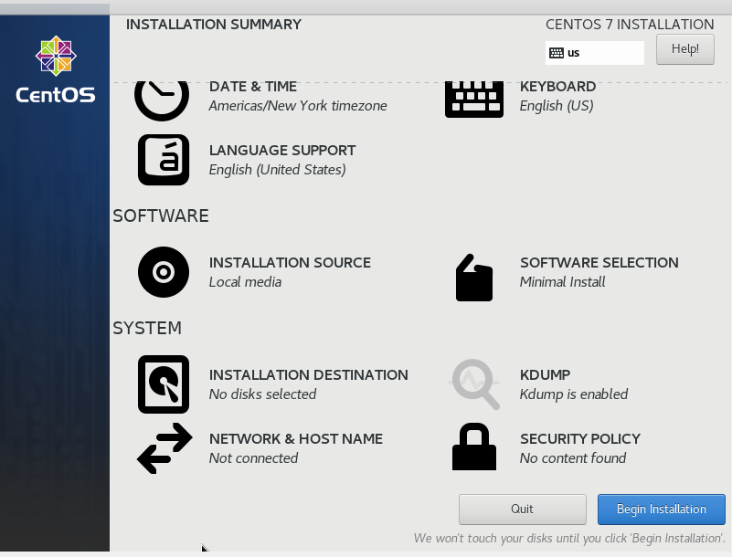

# Install Linux Virtual Machine

1. Buka Oracle VM Virtual Box, klik new.

	

1. Beri nama, Type : Linux, Version : RedHat 64bit, Klik Enter.

	

1. Klik next pada Memory size (default).

	

1. Klik Create pada create virtual hardisk (default).

	

1. Pada Hardisk file type klik next (default).

	

1. Pada Storage on physical hardisk pilih dynamic.

	

1. Pilih File location and size. Klik enter.

	

1. Buka Virtual Machine, pilih CentOS.iso, klik enter.

	

1. Pilih install CentOS

	

1. Pilih Bahasa

	
1. Pilih lokasi instalasi klik local standard disk

1. Klik begin installation

1. Setting user, tunggu instalasi selesai.

1. Klik reboot

1. login.
